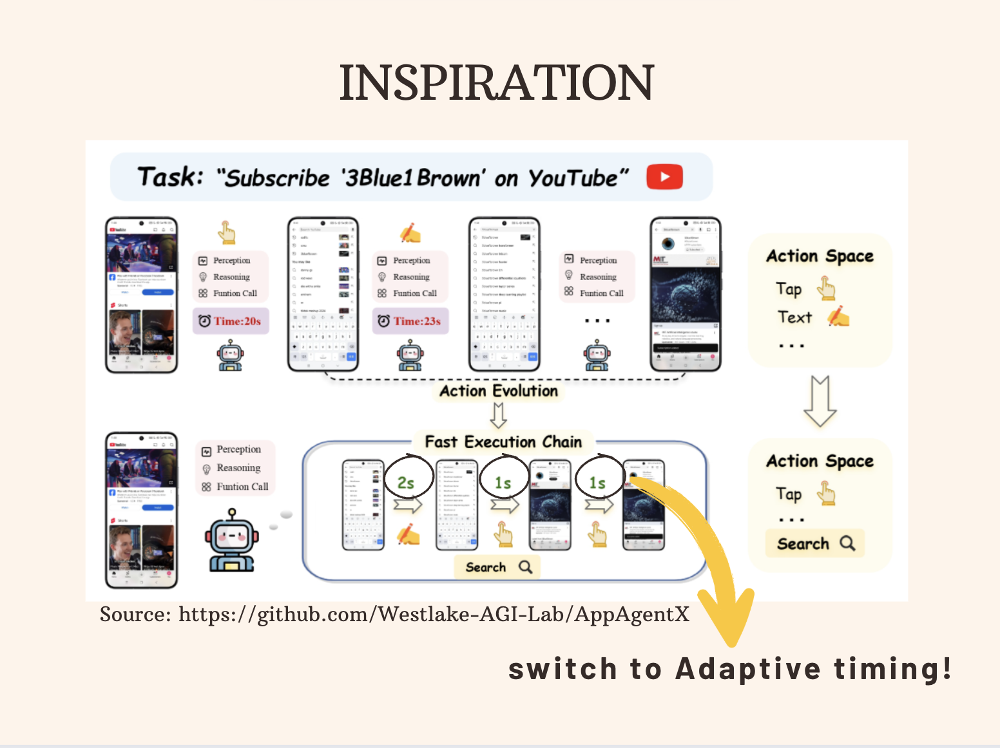
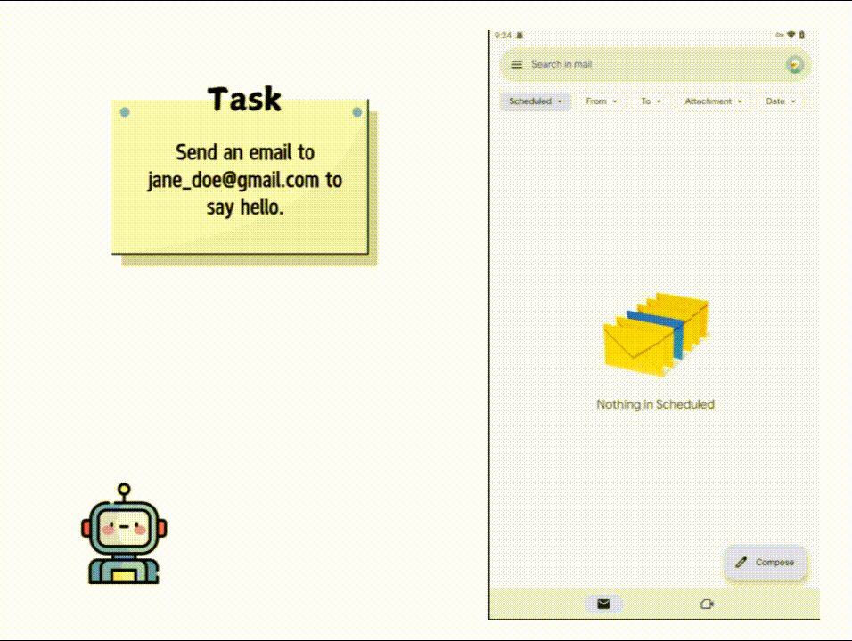

# TikTok_TechJam - Team Untitled

## 🤵‍♀️ Agent 007 : Enhanced GUI Automation System

The full technical documentation for Agent 007 can be found [here](Technical Documentation\_ Agent 007.pdf).

### Table of Contents

- [Project Overview](#project-overview)
- [Key Innovation: Dynamic Completion Detection](#key-innovation-dynamic-completion-detection)
- [Performance Improvement Results](#performance-improvement-results)
- [APIs Used in the Project](#apis-used-in-the-project)

  - [External APIs](#external-apis)
  - [Internal Service APIs](#internal-service-apis)

- [Libraries Used in the Project](#libraries-used-in-the-project)
- [Technical Architecture](#technical-architecture)

  - [Dynamic Completion Detection System](#dynamic-completion-detection-system)
  - [Unified Parser System](#unified-parser-system)
  - [Multi-Modal Integration](#multi-modal-integration)

- [Performance Optimization Techniques](#performance-optimization-techniques)
- [Results and Impact](#results-and-impact)
- [Getting Started](#getting-started)
- [Contributors](#contributors)

---

### Problem Statement

With the explosive growth of mobile Internet and smart devices, GUIs are becoming increasingly complex and evolving rapidly. This drives the demand for high-quality application assurance. Manual testing is expensive, so automated GUI testing has become mainstream, especially for regression and compatibility testing.

However, most research in GUI automation with LLMs/MLLMs focuses only on **UI element localization**, leading to poor success rates in real-world dynamic scenarios.

---

### Project Overview

**007** is an advanced GUI automation system that improves **inference efficiency** through:

- **Dynamic state change detection**
- **Multi-modal parser integration**

Inspired by [AdaT](https://github.com/sidongfeng/AdaT/tree/main) and [AppAgentX](https://github.com/Westlake-AGI-Lab/AppAgentX), the system replaces fixed hardcoded timing with **adaptive completion detection**, enabling faster and more reliable workflows.



---

### Key Innovation: Dynamic Completion Detection

- **Before**: Fixed timers per workflow step (inefficient, sometimes too early/late).
- **Now**: Dynamic state change capture to detect when a step is truly complete.
- Inspired by AdaT’s adaptive testing approach.

---

### Performance Improvement Results

- **Workflow 1 (Google Maps: Nearest coffee place)**

  - Before: 20.7s → After: 10.47s (**49.4% faster**)


- **Workflow 2 (TikTok Scrolling & Liking)**

  - Before: 27.2s → After: 22.99s (**15.5% faster**)



---

### APIs Used in the Project

#### External APIs

- OpenAI CLIP API – Visual understanding
- Google Gemini API – LLM reasoning & decision making
- Pinecone API – Vector database
- Neo4j API – Knowledge graph storage
- EasyOCR API – Text recognition

#### Internal Service APIs

- OmniParser Service (Port 8000) – High-accuracy YOLO-based parser
- CLIP Parser Service (Port 8002) – Fast UI detection
- Feature Extractor Service (Port 8001) – Embeddings
- Binary UI Classifier – Completion detection

---

### Libraries Used in the Project

---

<p align="center">
  
  
  
  
  
  
  
  
  
  
  
  
  
</p>

| Category          | Library                                                            | Description               |
| ----------------- | ------------------------------------------------------------------ | ------------------------- |
| AI/ML             | torch, transformers, openai-clip, sentence-transformers, faiss-cpu | Core ML & embeddings      |
| Computer Vision   | opencv-python, pillow, easyocr                                     | Vision & OCR              |
| Web Frameworks    | fastapi, gradio, uvicorn                                           | Backend & demos           |
| Databases         | neo4j, pinecone-client, chromadb                                   | Graph & vector storage    |
| Mobile Automation | pure-python-adb, selenium                                          | Device/browser automation |
| NLP               | langchain, langgraph, langchain-openai, langchain-google-genai     | LLM integration           |
| Utilities         | numpy, pandas, dotenv, asyncio, aiohttp, lxml                      | Core utilities            |

---

### Technical Architecture

#### Dynamic Completion Detection System

```python
class AdaptiveWait:
    """
    Adaptive waiting system using AdaT's binary classification approach
    """
    def __init__(self, model_path=None, max_wait_time=5.0):
        self.classifier = BinaryUI(model_path)
        self.max_wait_time = max_wait_time

    def wait_for_completion(self, screenshot_func, description="action"):
        """Intelligently wait for UI action completion"""
        # Dynamic state monitoring instead of fixed timers
```

#### Unified Parser System

- **OmniParser (YOLO-based, high accuracy, slower)**
- **CLIP Parser (fast, light)**
- **Auto-switching**: Picks optimal parser based on context

#### Multi-Modal Integration

- CLIP for visual understanding
- AdaT classifier for completion detection
- FAISS for vector similarity search

---

### Performance Optimization Techniques

- **Dynamic State Monitoring** → replace fixed timers with real-time detection
- **Parser Selection Strategy** → OmniParser (heavy) vs CLIP (speed)
- **Caching** → vector caching for repeated recognition

---

### Results and Impact

- **53.35% faster execution** on average
- Eliminates timing-related failures
- Optimizes resource usage (parser selection)
- Scales to complex workflows

---

### Getting Started

#### 1. Clone the Repository

```bash
git clone https://github.com/JanhaveeSingh/TikTok_TechJam_Team-_Untitled.git
```

#### 2. Create a Virtual Environment

```bash
python3 -m venv venv
source venv/bin/activate   # On Linux / Mac
venv\Scripts\activate      # On Windows
```

#### 3. Install Dependencies

```bash
pip install -r requirements.txt
```

#### 4. Set up your .env file

```bash
# LLM Configuration for Gemini 2.5
LLM_PROVIDER=gemini
LLM_API_KEY=xxxxx
LLM_MODEL=gemini-1.5-flash
LLM_MAX_TOKEN=1500
LLM_REQUEST_TIMEOUT=500
LLM_MAX_RETRIES=3

# Gemini-specific (optional, usually same as LLM_API_KEY)
GEMINI_API_KEY=xxxx

# LangChain Configuration
LANGCHAIN_TRACING_V2=false
LANGCHAIN_ENDPOINT=https://api.smith.langchain.com
LANGCHAIN_API_KEY=xxxx

# Neo4j Configuration
NEO4J_URI=xxxx
NEO4J_USERNAME=neo4j
NEO4J_PASSWORD=xxxx

# Feature Extractor Configuration
FEATURE_URI=http://127.0.0.1:8001

# Screen Parser Configuration
OMNI_URI=http://127.0.0.1:8000

# Vector Storage Configuration
PINECONE_API_KEY=xxxx
```

#### 5. Database Deployment and Connection

The project leverages Neo4j for memory storage, allowing efficient retrieval of nodes via Cypher queries. Pinecone is used for vector storage. Ensure that all necessary API keys and configurations are correctly set in the [config.py](config.py). For more information, refer to the Neo4j documentation and Pinecone documentation.

#### 6. Set up the backend

> Refer to : [ReadME](backend/README.md)

#### 7. Launching the Demo

Before running the demo, you need to set up ADB (Android Debug Bridge) to connect your Android device to your computer.

> Setting Up ADB and Connecting Your Device

Install ADB on your PC.

- Enable USB Debugging on your Android device:
- Navigate to Settings > Developer Options and turn on USB Debugging.
- Connect your device to your computer using a USB cable.

Using an Emulator (Optional):

- If a physical device is unavailable, you can use an Android emulator:
- Install Android Studio.
- Open Device Manager to create and launch an emulator.
- Install apps by dragging APK files into the emulator window.
- AppAgent works with the emulator just like a real device.

#### 8. Run the Demo

```bash
python demo.py
```

or

```bash
gradio demo.py
```

---

### Contributors

- 👩‍💻 **Janhavee Singh** – [@JanhaveeSingh](https://github.com/JanhaveeSingh)
- 👩‍💻 **Rishika Mehta** - [@Oganesson0221](https://github.com/Oganesson0221)
- 👩‍💻 **Yi Hsuen Cheng** – [@yiihsuenn](https://github.com/yiihsuenn)
- 👩‍💻 **Risha Sunil Shetty** – [@RISHASUN001](https://github.com/RISHASUN001)
