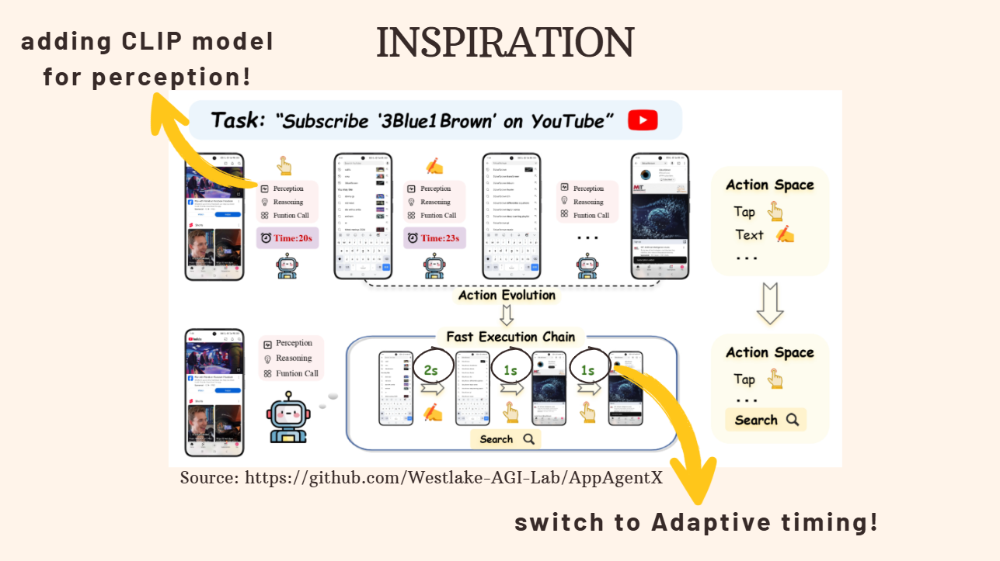

# TikTok_TechJam - Team Untitled

## 007 : Enhanced GUI Automation System



## Table of Contents

* [Project Overview](#project-overview)
* [Key Innovation: Dynamic Completion Detection](#key-innovation-dynamic-completion-detection)
* [Performance Improvement Results](#performance-improvement-results)
* [APIs Used in the Project](#apis-used-in-the-project)

  * [External APIs](#external-apis)
  * [Internal Service APIs](#internal-service-apis)
* [Libraries Used in the Project](#libraries-used-in-the-project)
* [Technical Architecture](#technical-architecture)

  * [Dynamic Completion Detection System](#dynamic-completion-detection-system)
  * [Unified Parser System](#unified-parser-system)
  * [Multi-Modal Integration](#multi-modal-integration)
* [Performance Optimization Techniques](#performance-optimization-techniques)
* [Results and Impact](#results-and-impact)
* [Getting Started](#getting-started)
* [Contributors](#contributors)

---

## Problem Statement

With the explosive growth of mobile Internet and smart devices, GUIs are becoming increasingly complex and evolving rapidly. This drives the demand for high-quality application assurance. Manual testing is expensive, so automated GUI testing has become mainstream, especially for regression and compatibility testing.

However, most research in GUI automation with LLMs/MLLMs focuses only on **UI element localization**, leading to poor success rates in real-world dynamic scenarios.

---

## Project Overview

**007** is an advanced GUI automation system that improves **inference efficiency** through:

* **Dynamic state change detection**
* **Multi-modal parser integration**

Inspired by [AdaT](https://github.com/sidongfeng/AdaT/tree/main) and [AppAgentX](https://github.com/Westlake-AGI-Lab/AppAgentX), the system replaces fixed hardcoded timing with **adaptive completion detection**, enabling faster and more reliable workflows.

---

## Key Innovation: Dynamic Completion Detection

* **Before**: Fixed timers per workflow step (inefficient, sometimes too early/late).
* **Now**: Dynamic state change capture to detect when a step is truly complete.
* Inspired by AdaT’s adaptive testing approach.

---

## Performance Improvement Results

* **Workflow 1 (Google Maps: nearest coffee place)**

  * Before: 20.7s → After: 10.47s (**49.4% faster**)

* **Workflow 2 (Google Maps: nearest restaurants)**

  * Before: 21.2s → After: 9.06s (**57.3% faster**)


---

## APIs Used in the Project

### External APIs

* OpenAI CLIP API – Visual understanding
* Google Gemini API – LLM reasoning & decision making
* Pinecone API – Vector database
* Neo4j API – Knowledge graph storage
* EasyOCR API – Text recognition

### Internal Service APIs

* OmniParser Service (Port 8000) – High-accuracy YOLO-based parser
* CLIP Parser Service (Port 8002) – Fast UI detection
* Feature Extractor Service (Port 8001) – Embeddings
* Binary UI Classifier – Completion detection

---

## Libraries Used in the Project
#### AI / ML
 

 
 

#### Computer Vision
 
 

#### Web Frameworks
 
 <!-- Gradio logo -->
 

#### Databases
 
 <!-- Pinecone -->
 <!-- ChromaDB -->

#### Mobile Automation
 
 

#### NLP
 <!-- LangChain -->
 <!-- OpenAI -->
 <!-- Google GenAI -->

#### Utilities
 
 

| Category          | Library                                                            | Description               |
| ----------------- | ------------------------------------------------------------------ | ------------------------- |
| AI/ML             | torch, transformers, openai-clip, sentence-transformers, faiss-cpu | Core ML & embeddings      |
| Computer Vision   | opencv-python, pillow, easyocr                                     | Vision & OCR              |
| Web Frameworks    | fastapi, gradio, uvicorn                                           | Backend & demos           |
| Databases         | neo4j, pinecone-client, chromadb                                   | Graph & vector storage    |
| Mobile Automation | pure-python-adb, selenium                                          | Device/browser automation |
| NLP               | langchain, langgraph, langchain-openai, langchain-google-genai     | LLM integration           |
| Utilities         | numpy, pandas, dotenv, asyncio, aiohttp, lxml                      | Core utilities            |


---

## Technical Architecture

### Dynamic Completion Detection System

```python
class AdaptiveWait:
    """
    Adaptive waiting system using AdaT's binary classification approach
    """
    def __init__(self, model_path=None, max_wait_time=5.0):
        self.classifier = BinaryUI(model_path)
        self.max_wait_time = max_wait_time
    
    def wait_for_completion(self, screenshot_func, description="action"):
        """Intelligently wait for UI action completion"""
        # Dynamic state monitoring instead of fixed timers
```

### Unified Parser System

* **OmniParser (YOLO-based, high accuracy, slower)**
* **CLIP Parser (fast, memory tradeoff)**
* **Auto-switching**: Picks optimal parser based on context

### Multi-Modal Integration

* CLIP for visual understanding
* AdaT classifier for completion detection
* FAISS for vector similarity search

---

## Performance Optimization Techniques

* **Dynamic State Monitoring** → replace fixed timers with real-time detection
* **Parser Selection Strategy** → OmniParser (accuracy) vs CLIP (speed)
* **Caching** → vector caching for repeated recognition
* **Memory/Speed Tradeoff** → CLIP uses more memory but accelerates inference

---

## Results and Impact

* **53.35% faster execution** on average
* Eliminates timing-related failures
* Optimizes resource usage (parser selection)
* Scales to complex workflows

---

## Getting Started

### 1. Clone the Repository

```bash
git clone https://github.com/your-username/007-GUI-Automation.git
cd 007-GUI-Automation
```

### 2. Create a Virtual Environment

```bash
python3 -m venv venv
source venv/bin/activate   # On Linux / Mac
venv\Scripts\activate      # On Windows
```

### 3. Install Dependencies

```bash
pip install -r requirements.txt
```

### 4. Run the Demo

```bash
python demo.py
```

---

## Contributors

* 
